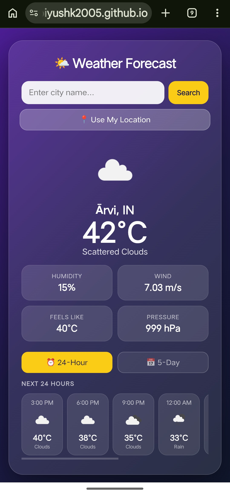

<div align="center">


# 🌤️ Weather App

**A clean, real-time weather application built with React + Vite**

[](https://piyushk2005.github.io/Weather-App/)
[](https://react.dev/)
[](https://vitejs.dev/)
[](https://openweathermap.org/)
[](https://pages.github.com/)

</div>

---

## 📽️ Demo


<div align="center">
  
</div>

---

## 📸 Screenshots


<div align="center">
  
  &nbsp;&nbsp;
  
</div>

---

## ✨ Features

- 🔍 **Search any city** worldwide by name
- 📍 **Current location** — auto-detect weather via GPS
- ⏰ **24-hour forecast** — hourly weather for the next 24 hours
- 📅 **5-day forecast** — daily high/low temps, humidity & wind
- 🌡️ **Real-time temperature** in Celsius
- 💧 **Humidity, wind speed, pressure & feels like** data
- 🌥️ **Weather condition icons** (sunny, cloudy, rainy, etc.)
- 📱 **Responsive design** — works on mobile & desktop
- ⚡ **Fast & lightweight** — built with Vite

---

## 🛠️ Tech Stack

| Technology | Purpose |
|---|---|
| [React 19](https://react.dev/) | UI framework |
| [Vite 8](https://vitejs.dev/) | Build tool & dev server |
| [OpenWeatherMap API](https://openweathermap.org/api) | Live weather data |
| [GitHub Pages](https://pages.github.com/) | Hosting & deployment |

---

## 🚀 Getting Started

### Prerequisites

- [Node.js](https://nodejs.org/) v18 or higher
- [Git](https://git-scm.com/)
- Free [OpenWeatherMap API key](https://home.openweathermap.org/api_keys)

### Installation

```bash
# 1. Clone the repository
git clone https://github.com/piyushk2005/Weather-App.git

# 2. Navigate into the project
cd Weather-App

# 3. Install dependencies
npm install

# 4. Create your environment file
cp .env.example .env
```

### Configure API Key

Open the `.env` file and add your OpenWeatherMap API key:

```env
VITE_API_KEY=your_api_key_here
```

> 🔑 Get a free API key at [openweathermap.org](https://home.openweathermap.org/api_keys)

### Run Locally

```bash
npm run dev
```

Then open [http://localhost:5173/Weather-App/](http://localhost:5173/Weather-App/) in your browser.

---

## 📦 Build & Deploy

```bash
# Build for production
npm run build

# Preview production build locally
npm run preview

# Deploy to GitHub Pages
npm run deploy
```

---

## 📁 Project Structure

```
Weather-App/
├── assets/
│   ├── demo.gif                  # Demo GIF for README
│   ├── screenshot-home.png       # Screenshot 1
│   └── screenshot-forecast.png  # Screenshot 2
├── public/
│   └── icons.svg                 # App favicon
├── src/
│   ├── components/
│   │   ├── SearchBar.jsx         # Search + location button
│   │   ├── WeatherCard.jsx       # Current weather display
│   │   ├── HourlyForecast.jsx    # 24-hour forecast
│   │   ├── DailyForecast.jsx     # 5-day forecast
│   │   └── Loader.jsx            # Loading spinner
│   ├── App.jsx                   # Main app component
│   ├── App.css                   # Component styles
│   ├── main.jsx                  # React entry point
│   └── index.css                 # Global styles
├── .env                          # Local API key (never commit!)
├── .env.example                  # Template for API key setup
├── .gitignore
├── index.html
├── package.json
├── vite.config.js
└── README.md
```

---

## ⚙️ Environment Variables

| Variable | Description | Required |
|---|---|---|
| `VITE_API_KEY` | Your OpenWeatherMap API key | ✅ Yes |

> ⚠️ Never commit your `.env` file. It is already listed in `.gitignore`.

---

## 🌐 Live Site

**[https://piyushk2005.github.io/Weather-App/](https://piyushk2005.github.io/Weather-App/)**

---

## 🤝 Contributing

Contributions, issues and feature requests are welcome!

1. Fork the repo
2. Create a branch: `git checkout -b feature/your-feature`
3. Commit changes: `git commit -m "Add your feature"`
4. Push to branch: `git push origin feature/your-feature`
5. Open a Pull Request

---

## 📄 License

This project is open source and available under the [MIT License](LICENSE).

---

<div align="center">

Made with ❤️ by [Piyush Kalambe](https://github.com/piyushk2005)

⭐ **Star this repo if you found it helpful!**

</div>
